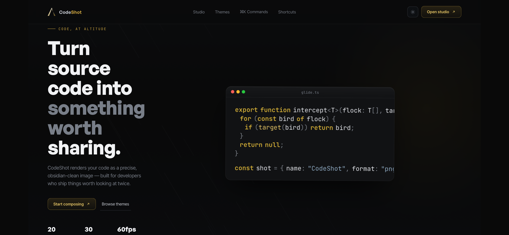
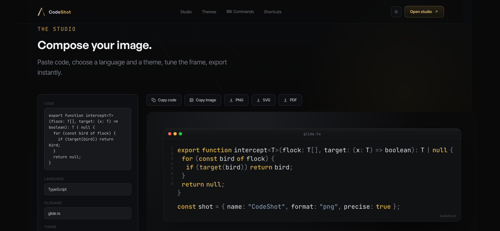

## Screenshots





# CodeShot

Turn source code into clean, shareable images. Paste code, pick a language and theme, tune the frame, export as PNG, SVG, or PDF — or copy straight to your clipboard.

**[Live demo →](https://uuluou.github.io/CodeShot/)**

---

## Features

- **30 languages** — TypeScript, JavaScript, Python, Go, Rust, C, C++, Java, C#, PHP, Ruby, Swift, Kotlin, SQL, YAML, Markdown, XML, SCSS, LESS, Lua, Perl, Dart, GraphQL, Dockerfile, PowerShell, Bash, HTML, CSS, JSON, and plaintext.
- **20 curated themes** — dark and light, filterable by mode.
- **Live editor & preview** — instant syntax highlighting as you type.
- **Full customization** — monospace font, corner radius, padding/margin, drop shadow style, background (gradient, solid, custom color, or transparent), line numbers, watermark.
- **Export presets** — Auto (dynamic size), Twitter/X, Instagram, Pinterest aspect ratios.
- **Export formats** — PNG, SVG, PDF, and direct clipboard copy.
- **Command palette** (`⌘K` / `Ctrl+K`) and full keyboard shortcuts (see below).
- **Light/dark interface mode**, independent of the code preview theme, following your system preference by default.
- **Fully responsive** — reworked layouts for phone, tablet, and desktop.

## Keyboard shortcuts

| Action | Shortcut |
|---|---|
| Command palette | `⌘/Ctrl K` |
| Export PNG | `⌘/Ctrl S` |
| Export SVG | `⌘/Ctrl Shift S` |
| Export PDF | `⌘/Ctrl E` |
| Copy image to clipboard | `⌘/Ctrl Shift C` |
| Toggle line numbers | `⌘/Ctrl \` |
| Toggle light/dark interface | `⌘/Ctrl J` |
| Show shortcuts panel | `?` |
| Close any panel | `Esc` |

## Tech stack

Plain HTML, CSS, and JavaScript — no framework, no build step, no dependencies to install.

- [html2canvas](https://html2canvas.hertzen.com/) — DOM-to-canvas rendering for PNG/SVG/PDF export
- [jsPDF](https://github.com/parallax/jsPDF) — PDF generation
- Google Fonts (JetBrains Mono, Fira Code, IBM Plex Mono, Source Code Pro, Space Mono, Inter Tight) and Fontshare (General Sans)

Both libraries are loaded via CDN in `index.html`, so there's nothing to `npm install`.

## Project structure

```
codeshot/
├── index.html    structure and markup
├── style.css     all styling
└── script.js     all logic (syntax highlighting, export, UI)
```

All three files must stay in the same folder — `index.html` references the other two by relative path.

## Running it locally

Because the export/clipboard features rely on browser APIs that behave better over `http(s)` than a bare `file://` path, serve the folder instead of double-clicking `index.html`:

```bash
cd codeshot
python3 -m http.server 8000
# then open http://localhost:8000
```

Any static server works (`npx serve`, VS Code's Live Server extension, etc.) — this is just the option with no install required.

## Known limitations

- SVG export embeds a rasterized PNG inside an SVG wrapper rather than true vector text (browsers don't reliably rasterize live DOM-to-vector text across engines).
- Clipboard image copy requires a browser that supports the `ClipboardItem` API (Chrome and most Chromium-based browsers; Safari support is partial).
- Custom web fonts may occasionally fall back to a system monospace font in exported images in browsers that restrict cross-origin stylesheet access during canvas rendering.

## License

MIT — see [LICENSE](LICENSE).
